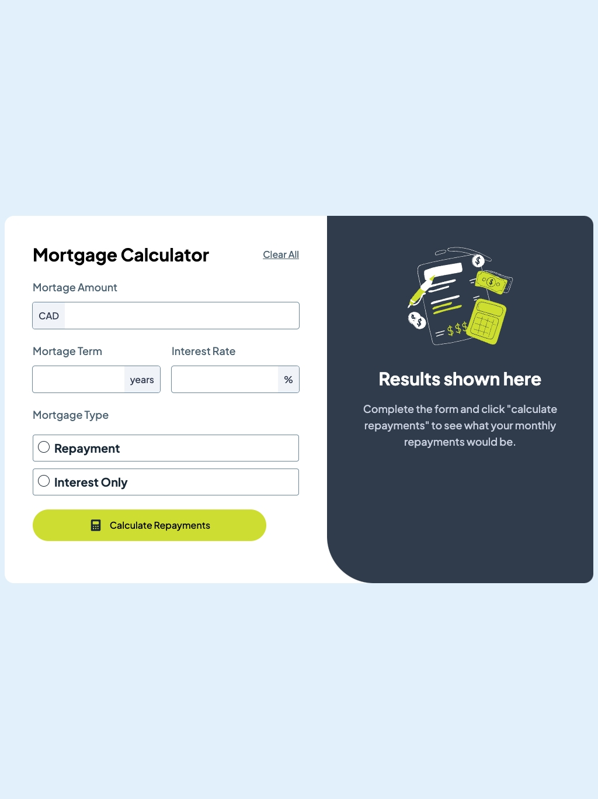
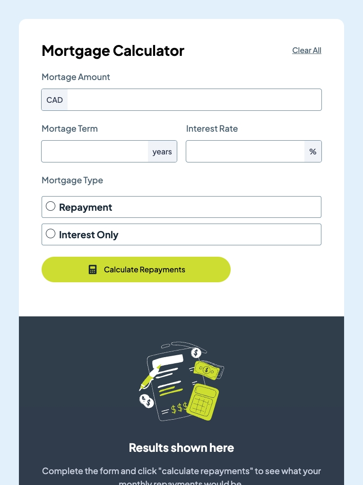
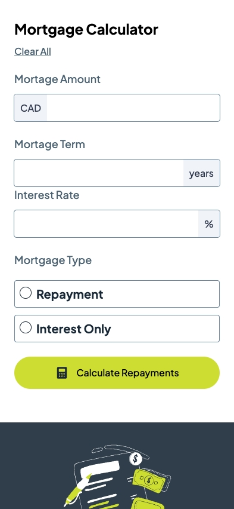

# React Typescript Mortgage Calculator

## Description 📝

A simple and accessible mortgage calculator that lets users estimate monthly payments and total repayment amounts in real time. Built with a focus on clear form interactions, client-side validation, and an inclusive user experience.

## 🚀 Technologies Used

- ⚛️ **React 19**
- 💻 **Typescript**
- 🎨 **Tailwind**
- ⚡️ **Vite**

## 📦 Installation and Usage

1. Clone the repository:

   ```sh
   git clone https://github.com/anabelena/mortage-calculator
   ```

2. Navigate to the project directory:

   ```sh
   cd mortgage-calculator
   ```

3. Install dependencies:

   ```sh
   npm install
   ```

4. Start the development server:

   ```sh
   npm run dev
   ```

## Screenshots 📷

### 🖥️ Desktop view



### 💻 Tablet view



### 📱 Mobile view



## 🌐 Live Demo

👉 [react-gym-app.pages.dev](https://react-gym-app.pages.dev)

## Contact 📧

Developed by 👩🏻‍💻[anabelena](https://github.com/anabelena)
